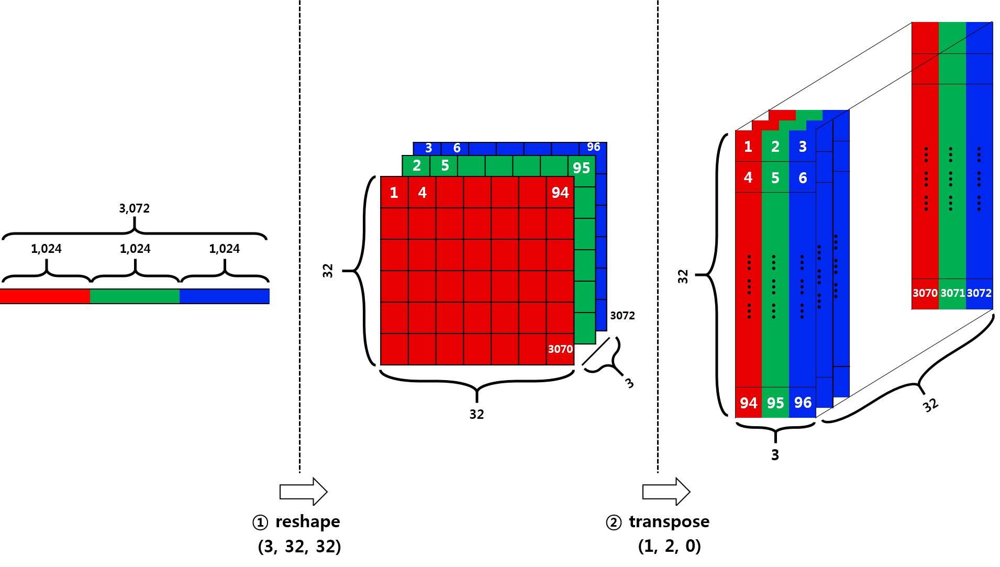
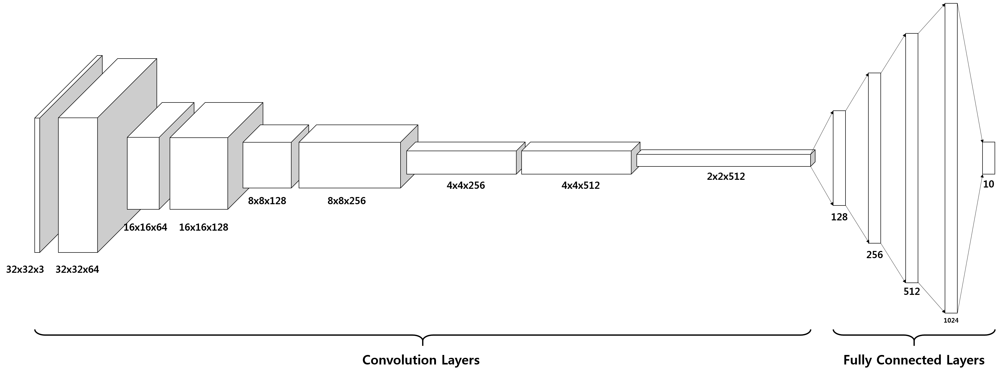
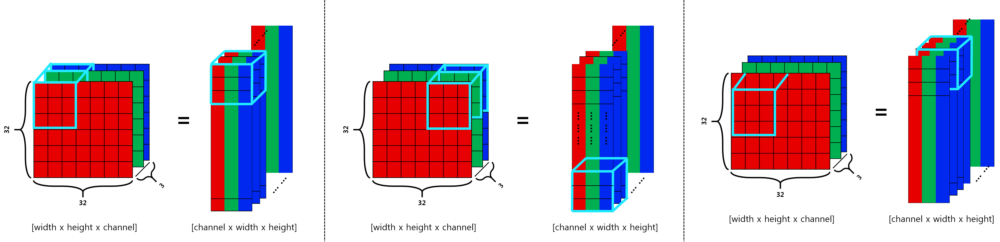
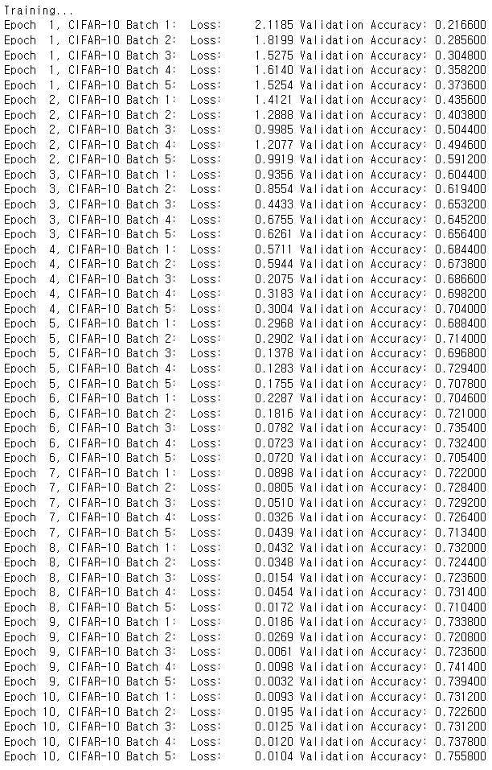
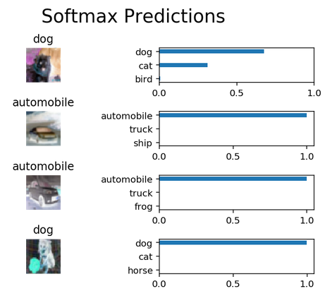

# Image Classification with CIFAR-10 dataset
In this notebook, I am going to classify images from the [CIFAR-10 dataset](https://www.cs.toronto.edu/~kriz/cifar.html).  The dataset consists of airplanes, dogs, cats, and other objects. You'll preprocess the images, then train a convolutional neural network on all the samples. The images need to be normalized and the labels need to be one-hot encoded. Some more interesting datasets can be found [here](http://rodrigob.github.io/are_we_there_yet/build/#datasets)

Some of the code and description of this notebook is borrowed by [this repo](https://github.com/udacity/deep-learning/tree/master/image-classification) provided by Udacity's Deep Learning Nanodegree program. This notebook has been reproduced decorated with richer descriptions after completing the Udacity's project.

# Contents
##### 1. Get the Data
##### 2. Understanding the dataset
##### 3. Hands-on experience implementing normalize and one-hot encoding function
##### 4. Tensorflow Basics
##### 5. Model Architecture and construction (Using different types of APIs (tf.nn, tf.layers, tf.contrib))
##### 6. Training the model (how to feed and evaluate Tensorflow graph?)
##### 7. Prediction
### please open up the jupyter notebook to see the full descriptions

# 2. Understanding the dataset
The original a batch data is (10000 x 3072) dimensional tensor expressed in numpy array, where the number of columns, (10000), indicates the number of sample data. As stated in the [CIFAR-10/CIFAR-100 dataset](https://www.cs.toronto.edu/~kriz/cifar.html), the row vector, (3072) represents an color image of 32x32 pixels.

Since this project is going to use CNN for the classification tasks, the row vector, (3072), is not an appropriate form of image data to feed. In order to feed an image data into a CNN model, the dimension of the tensor representing an image data should be either (width x height x num_channel) or (num_channel x width x height).

It depends on your choice (check out the [tensorflow conv2d](https://www.tensorflow.org/api_docs/python/tf/nn/conv2d)). In this particular project, I am going to use the dimension of the first choice because the default choice in tensorflow's CNN operation is so.

The row vector (3072) has the exact same number of elements if you calculate 32\*32\*3==3072. In order to reshape the row vector, (3072), there are two steps required. The **first** step is involved with using **reshape** function in numpy, and the **second** step is involved with using **transpose** function in numpy as well.

# 5. Model Architecture

The entire model consists of 14 layers in total. In addition to layers below lists what techniques are applied to build the model.

1. Convolution with 64 different filters in size of (3x3)
2. Max Pooling by 2
  - ReLU activation function
  - Batch Normalization
3. Convolution with 128 different filters in size of (3x3)
4. Max Pooling by 2
  - ReLU activation function
  - Batch Normalization
5. Convolution with 256 different filters in size of (3x3)
6. Max Pooling by 2
  - ReLU activation function
  - Batch Normalization
7. Convolution with 512 different filters in size of (3x3)
8. Max Pooling by 2
  - ReLU activation function
  - Batch Normalization
9. Flattening the 3-D output of the last convolutional operations.
10. Fully Connected Layer with 128 units
  - Dropout
  - Batch Normalization
11. Fully Connected Layer with 256 units
  - Dropout
  - Batch Normalization
12. Fully Connected Layer with 512 units
  - Dropout
  - Batch Normalization
13. Fully Connected Layer with 1024 units
  - Dropout
  - Batch Normalization
14. Fully Connected Layer with 10 units (number of image classes)

the image below decribes how the conceptual convolving operation differs from the tensorflow implementation when you use [Channel x Width x Height] tensor format.

# 6. Training the model
achieving over 75% accuracy in 10 epochs through 5 batches.

# 7. Prediction

